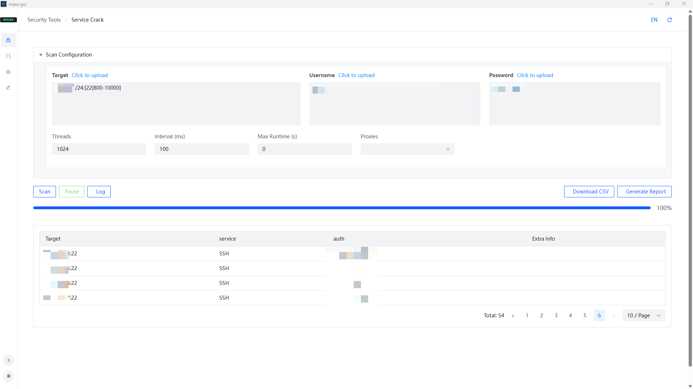

  

> This tool is intended for use by authorized security testers only. Unauthorized testing is prohibited and will be at your own risk.

## Maxx-gui
Maxx-gui is the graphical user interface built on the Maxx engine, designed to streamline usage of Maxx tools through intuitive visual controls.

## MaXx

MaXx is a modular network security scanner combining:

- Port scanning with service fingerprinting (Coming soon)
- Vulnerability assessment (CVE detection) (Coming soon)
- Credential auditing (Brute-force & dictionary attacks) (Implemented in the initial release)
- Automated exploit chaining (Beta:Coming soon)

> If you like this tool, please star it~

### Snapshot

