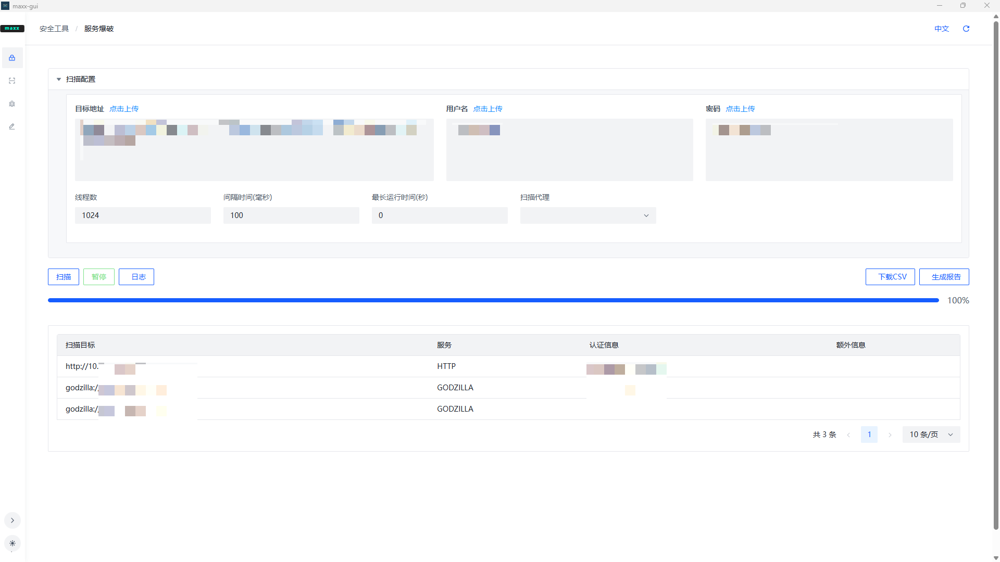

  

> 本工具仅供授权的安全测试人员使用。未经授权的测试是被禁止的，风险自负。

## Maxx-gui
Maxx-gui 是一个基于 Maxx 引擎的图形化用户界面，用于简化 Maxx 工具的使用。

## MaXx

MaXx 是一个模块化的网络安全扫描器，集成了以下功能：

-   端口扫描与服务指纹识别（即将推出）
-   漏洞评估（漏洞挖掘与验证）（即将推出）
-   凭证审计（暴力破解与字典攻击）（已在初始版本实现）
-   自动化漏洞利用链（Beta：即将推出）

> 如果你喜欢这个工具，请为它点个 star~

### Snapshot

